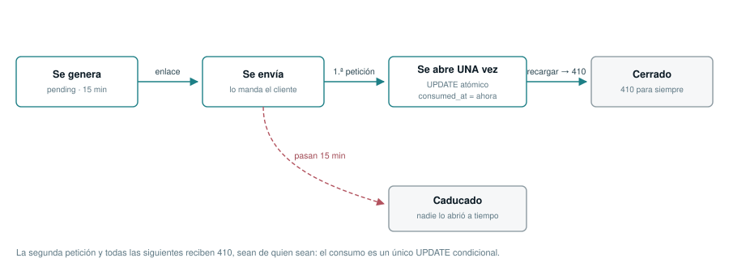

# Cómo funciona Vistta

> **Resumen:** Qué problema resuelve, cómo funciona un pase de un solo uso, y qué promete el producto de verdad y qué no.

## El problema

Un fotógrafo termina una sesión y tiene que enseñarla al cliente antes de
cobrarla. Un estudio de arquitectura manda un dosier a un concurso. Un
diseñador presenta una propuesta que todavía no está pagada.

Lo que se usa hoy para eso —un enlace de Drive, un WeTransfer, un PDF por
correo— tiene el mismo problema: **una vez que sale, ya no vuelve**. El enlace
se reenvía, la carpeta sigue abierta meses después, y no hay forma de saber si
lo que circula es la versión que se envió.

## La propuesta

Un **pase**: un enlace privado que se abre **una sola vez** y se cierra al
abrirse.

_Ciclo de vida de un pase. La segunda petición y todas las siguientes reciben
410, sean de quien sean._

Lo que eso cambia en la práctica:

- **Reenviar el enlace no sirve de nada.** Quien lo reciba de segundas se
  encuentra un enlace muerto, y el destinatario original se entera porque a él
  ya no le abre.
- **No queda una carpeta abierta.** El contenido caduca según el plan; no hay
  nada que revisar dentro de seis meses.
- **Cada visita deja su marca.** Las imágenes salen con un identificador de la
  visita **incrustado en los píxeles**, no superpuesto: guardar la imagen guarda
  la marca.

## Cómo se usa, en cuatro pasos

1. **Montas un perfil**: nombre, una frase de presentación, y bloques de texto
   o galería con tus fotos.
2. **Generas un pase.** El sistema congela una **instantánea** del contenido en
   ese momento: lo que el destinatario verá es lo que había cuando lo generaste,
   aunque después lo edites.
3. **Envías el enlace** por donde quieras: WhatsApp, correo, teléfono. Vistta no
   lo envía, y por eso **no sabe a quién se lo mandaste**.
4. **Se abre una vez.** A partir de ahí, muerto.

El enlace además **caduca a los 15 minutos si nadie lo abre**. Eso es a
propósito: un pase no es un archivo, es una cita.

## Qué promete Vistta, exactamente

Esto es lo que hace, y está probado:

- **El pase se abre una sola vez, y el consumo es atómico.** Aunque lleguen
  dieciséis peticiones simultáneas, solo una lo abre. Hay una prueba que lanza
  esa ráfaga contra una base de datos real.
- **Las imágenes llevan la marca de la visita dentro de los píxeles.** La imagen
  se decodifica, se le pinta el identificador encima y se vuelve a codificar: lo
  que sale por el cable no son los bytes que subiste.
- **Los medios solo se sirven por URL firmada y efímera**, y tras comprobar tres
  cosas: que la firma es nuestra y está vigente, que ese medio estaba en la
  instantánea de ese pase, y que el backend llegó a inspeccionarlo.
- **Ninguna cuenta ve la de al lado.**

## Qué NO promete, dicho aquí y no en la letra pequeña

- **No impide una captura de pantalla** ni una fotografía a la pantalla. Nada
  puede. Cualquier producto que prometa lo contrario está vendiendo humo.
- **El vídeo y los documentos se sirven sin marca de agua.** Marcarlos exigiría
  recodificarlos en cada visita, y eso no cabe en este producto hoy. El panel se
  lo dice al cliente **con esas palabras** antes de que suba nada.
- **No es DRM ni protección anticopia.** Bloquear el clic derecho no es
  seguridad y aquí no se hace.
- **No hay cifrado extremo a extremo**: el servidor ve el contenido, porque
  tiene que transformarlo para marcarlo.

> Esta honestidad no es un descargo de responsabilidad, es una decisión de
> producto: lo que Vistta ofrece es **trazabilidad** —saber de qué visita salió
> una copia— y **caducidad**, no invulnerabilidad.

## El contenido caduca, y ese es el producto

Vistta es para **enseñar** trabajo, no para alojarlo. En los planes Prueba y Pro
el contenido se borra pasada la retención del plan. El plan **Bóveda no caduca
nunca**, y de ahí el nombre.

Dos protecciones que se aplican siempre:

- Un medio que esté en la instantánea de **un pase todavía abrible no se borra**:
  ese enlace ya salió y tiene que seguir enseñando lo que prometía.
- Una retención nueva **no se aplica a contenido anterior** al plan actual, para
  que bajar de plan no evapore el archivo esa misma noche.

## Y pasarse de un límite no borra nada

Al bajar de plan, los perfiles que sobran quedan **congelados**: siguen ahí con
todo su contenido, no se editan y no generan pases. El dueño elige cuál deja
activo. Solo si un perfil agota entera la gracia de 30 días se borra.
