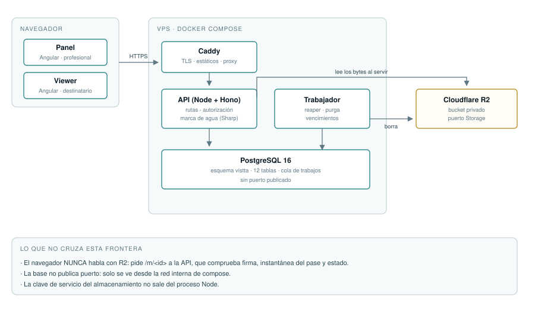

# Arquitectura

> **Resumen:** Cómo está construido el sistema, qué invariantes lo sostienen y por qué cada decisión importante se tomó así. Documento técnico.

## Vista de despliegue



_Cuatro contenedores. La base no publica puerto y el navegador nunca habla con
el almacenamiento de objetos._

## Estructura del código

```
src/
  server.ts          único que lee process.env y abre sockets
  app.ts             createApp(deps): monta las rutas con sus dependencias
  config.ts          validación de la configuración con Zod
  db.ts              interfaz Db: transacción y pool son intercambiables
  worker.ts          trabajador de la cola, en el mismo proceso
  routes/            adaptadores de entrada HTTP (7 archivos, 26 rutas)
  lib/               dominio y casos de uso (22 archivos)
  storage/           puerto Storage + 4 adaptadores
migrations/          SQL plano, esquema vistta
web/src/app/         panel, viewer, admin, legal (Angular)
```

**Es una arquitectura de puertos y adaptadores**, aunque las carpetas no se
llamen así. Lo que la sostiene:

- **Nadie lee `process.env` salvo `server.ts`.** Todo lo demás recibe una
  configuración ya validada. En Node no hay bindings del runtime, así que esto
  es lo único que separa «configurado» de «roto en producción».
- **Todo lo que toca la base recibe un `Db`, no un pool.** Transacción y pool
  cumplen la misma interfaz, así que las pruebas corren contra PostgreSQL real
  sin dobles y una función se puede llamar dentro o fuera de una transacción.
- **Los medios pasan por el puerto `Storage`.** Cambiar de proveedor es escribir
  otro adaptador, no tocar las rutas. Hay cuatro: `r2`, `supabase`, `fs` y
  `memory`.

## El invariante que define el producto

```sql
UPDATE vistta.passes SET status='consumed', consumed_at=$1
WHERE token_hash=$2 AND status='pending' AND expires_at > $1;
```

**Un único UPDATE condicional.** Solo la primera petición válida obtiene
`rowCount = 1`; el resto queda denegado, sin distinguir entre usado, caducado o
inexistente.

No es una optimización: es la definición del producto expresada en una
sentencia. Cualquier reescritura a «leer y luego escribir» lo rompe, y lo rompe
de forma silenciosa, porque con poco tráfico casi nunca se nota.

## Concurrencia: seis invariantes, y todos aparecieron

Todos fallan igual —dos peticiones simultáneas casi nunca se solapan, así que un
test de dos pasa aunque el código esté mal— y todos se prueban con **ráfagas de
16 peticiones**.

| Invariante              | Qué lo protege                                | Sin protección                          |
| ----------------------- | --------------------------------------------- | --------------------------------------- |
| Consumo del pase        | UPDATE condicional único                      | 13 de 16 consumían el mismo pase        |
| Reserva de cuota        | `SELECT … FOR UPDATE` sobre el perfil         | 12 de 16 reservas de 50 MB sobre 200 MB |
| Toma de trabajos        | `FOR UPDATE SKIP LOCKED`                      | 7 de 16 trabajadores cogían el mismo    |
| Pases simultáneos       | Fila de la cuenta bloqueada                   | 10 de 16 se saltaban el límite          |
| Perfiles del plan       | Fila de la cuenta bloqueada                   | 9 de 16 se colaban                      |
| Confirmación de un pago | `FOR UPDATE` **y** `WHERE status='pendiente'` | 10 de 16 cobraban el mismo código       |

> **Y `calentarPool()` antes de toda ráfaga.** Con el pool frío, la primera
> petición corre con la única conexión abierta y termina su transacción entera
> mientras las demás siguen haciendo el saludo TCP: no coinciden, y el test da
> verde aunque el código esté roto. Se descubrió porque el test del doble cobro
> pasaba habiéndole quitado **las dos** protecciones.

La regla que queda: **si añades un contador con un tope, da por hecho que tiene
carrera.** Escribe el `FOR UPDATE` y la prueba de ráfaga desde el principio.

## Cómo se sirve un medio

Tres puertas, y hacen falta las tres:

1. **La firma** dice que la URL la emitimos nosotros y aún no ha caducado.
2. **`pass_media`** dice que ese medio estaba en la instantánea de ese pase.
3. **`status = 'ready'`** dice que el backend llegó a inspeccionar esos bytes.

La primera sola no basta: era exactamente el fallo de aislamiento entre
inquilinos que se cerró en el bloque D.

La firma lleva **prefijo de longitud por campo** y **dominios separados para
lectura y escritura**. Concatenar con un separador no basta: si un campo admite
ese separador, dos juegos de campos distintos producen el mismo mensaje.

## La subida, en dos pasos y por qué

1. **`POST /api/media/presign`** valida sesión, propiedad, tipo, tamaño y cuota
   **antes** de aceptar un solo byte, y firma.
2. **`PUT /api/media/confirm`** trae los bytes, los identifica por sus _magic
   bytes_, los mide y solo entonces los guarda.

**Subir y confirmar son la misma petición a propósito.** Si fueran dos, entre
una y otra habría en el almacenamiento un objeto que nadie ha mirado, y bastaría
con no llamar a la segunda para dejarlo ahí.

## La marca de agua

La imagen se decodifica, se le compone encima una capa SVG con el identificador
de la visita y se reencodifica a WebP. **Sale siempre reencodificada**, aunque
la entrada ya fuera WebP: la salida no puede ser nunca una copia byte a byte, o
la marca sería opcional según el formato que subiera el cliente.

La capa lleva **el texto en diagonal repetido y una banda opaca abajo**. Las dos
cosas: la diagonal sobrevive a un recorte, la banda se lee de un vistazo, y la
banda es un rectángulo, así que si faltaran las fuentes del sistema algo queda
incrustado igual.

De paso, `rotate()` sin argumentos aplica la orientación EXIF y **tira los
metadatos**: ahí viven el GPS y el número de serie de la cámara, que no tienen
por qué viajar al destinatario.

## La cola

Vive en PostgreSQL, no en Redis: una dependencia menos, y los trabajos son pocos
y no urgentes. La toma es una sola sentencia con `FOR UPDATE SKIP LOCKED`, así
que varios trabajadores no se pisan.

Tres trabajos periódicos: el **reaper** de medios huérfanos, la **purga** por
retención y los **vencimientos** de plan.

## Seguridad, resumida

- Token del pase de 128 bits; en la base **solo su hash SHA-256**.
- Contraseñas con Argon2id. Las temporales se generan, no se teclean.
- `X-Forwarded-For` solo se mira con `TRUST_PROXY`, y entonces se toma la
  **última** entrada, que es la que añade el proxy propio. Caddy la **reescribe**
  en vez de añadirla.
- Cabeceras: CSP estricta en scripts, `frame-ancestors 'none'`,
  `Referrer-Policy: no-referrer`, `Cache-Control: no-store`, HSTS.
- **La clave de servicio del almacenamiento salta RLS**: toda la autorización
  multiinquilino recae en el código. RLS es la red, no la defensa.
- Los logs registran método, **patrón** de ruta y nombre del error. El patrón y
  no la URL: la ruta real lleva el token del pase, que es una credencial.

## Deuda técnica conocida

| Qué                                      | Por qué está así                          | Cuándo tocará                                     |
| ---------------------------------------- | ----------------------------------------- | ------------------------------------------------- |
| El objeto entero viaja en memoria        | Con el tope de vídeo en 50 MB es asumible | Cuando entre el streaming de vídeo                |
| El trabajador va en el proceso de la API | Simplicidad; comparte solo la base        | Cuando el volumen lo pida                         |
| Imagen de 445 MB                         | Binarios nativos de Sharp y Argon2        | Bajarla exige compilar contra libvips del sistema |
| El detector de tipo y Sharp se solapan   | Son dos defensas distintas                | No es deuda: es redundancia querida               |
