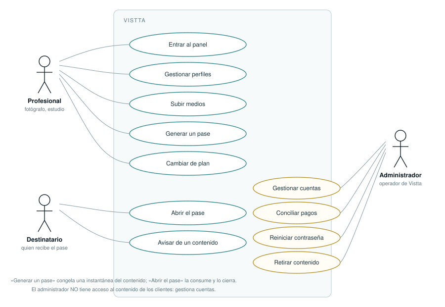

# Casos de uso

> **Resumen:** Actores, casos de uso y los flujos principales paso a paso, con sus caminos alternativos y lo que el sistema hace cuando algo va mal.

## Actores

| Actor                          | Quién es                                            | Cómo entra                      |
| ------------------------------ | --------------------------------------------------- | ------------------------------- |
| **Profesional**                | El cliente de Vistta: fotógrafo, estudio, diseñador | Panel, con usuario y contraseña |
| **Destinatario**               | A quien el profesional enseña su trabajo            | Un enlace, sin cuenta           |
| **Administrador**              | Quien opera Vistta                                  | Panel de administración         |
| **Sistema** _(actor temporal)_ | La cola de trabajos                                 | Automático                      |

> **El administrador gestiona cuentas, no contenido.** No hay ninguna ruta que
> le permita ver perfiles, medios ni pases de un cliente, y hay una prueba que
> lo comprueba sobre la respuesta real del servidor.

---

## CU-01 · Generar y enviar un pase

**Actor:** Profesional · **Precondición:** sesión abierta y un perfil activo con
contenido.

| #   | Actor                                    | Sistema                                                                   |
| --- | ---------------------------------------- | ------------------------------------------------------------------------- |
| 1   | Pulsa «Generar enlace»                   | Comprueba el límite de pases del plan **bloqueando la fila de la cuenta** |
| 2   |                                          | Genera un token opaco de 128 bits y guarda **solo su hash**               |
| 3   |                                          | Congela la **instantánea**: qué medios contiene el pase ahora             |
| 4   |                                          | Devuelve la URL y la fecha de caducidad (15 min)                          |
| 5   | Copia el enlace y lo envía por su cuenta | —                                                                         |

**Alternativas**

- _2a. El plan no da para más pases abiertos:_ se rechaza con el límite del plan
  y se ofrece cambiar de plan. No se genera nada.
- _3a. El perfil está congelado:_ no se puede generar. Un perfil congelado se lee
  pero no trabaja.

**Poscondición:** existe un pase `pending`. **Vistta no sabe a quién se envió.**

---

## CU-02 · Abrir un pase

**Actor:** Destinatario · **Precondición:** tiene el enlace.

| #   | Actor          | Sistema                                                                    |
| --- | -------------- | -------------------------------------------------------------------------- |
| 1   | Abre el enlace | Un **único UPDATE condicional** intenta consumirlo                         |
| 2   |                | Si lo consigue, firma URLs efímeras para los medios de la instantánea      |
| 3   |                | Devuelve el documento                                                      |
| 4   | Ve el trabajo  | Cada imagen se sirve con **la marca de esta visita** dentro de los píxeles |

**Alternativas**

- _1a. Ya se abrió, caducó o no existe:_ **410**, con el mismo mensaje para los
  tres. Al destinatario no se le cuenta la situación comercial de quien le mandó
  el enlace.
- _1b. Llegan 16 peticiones a la vez:_ exactamente una lo abre. Probado con
  ráfaga contra base real.
- _4a. Un medio ya no está en el almacenamiento:_ se oculta ese hueco; el resto
  del documento se ve igual.

**Poscondición:** el pase queda `consumed`. Recargar ya no muestra nada.

---

## CU-03 · Subir un medio

**Actor:** Profesional

| #   | Actor               | Sistema                                                           |
| --- | ------------------- | ----------------------------------------------------------------- |
| 1   | Elige archivos      | Pide reserva: valida sesión, propiedad, tipo, tamaño y **cuota**  |
| 2   |                     | Reserva cuota **bloqueando la fila del perfil** y firma la subida |
| 3   | Se envían los bytes | Detecta el tipo por sus _magic bytes_, mide los bytes **reales**  |
| 4   |                     | Mide dimensiones, genera miniatura y marca el medio como `ready`  |

**Alternativas**

- _1a. No queda cuota:_ 413. No se acepta ni un byte.
- _3a. El tamaño real no coincide con el declarado:_ se rechaza. El declarado no
  vale nada.
- _3b. El contenido no es lo que dice ser_ (un PDF subido como imagen): se
  rechaza y el medio queda `failed`; el reaper lo limpia.
- _3c. El cliente cierra la pestaña tras reservar:_ la reserva caduca y el reaper
  la recoge. La cuota se libera.

---

## CU-04 · Quedarse sin acceso

**Actor:** Profesional · **Disparador:** ha perdido la contraseña.

| #   | Actor                                                     | Sistema                                                                           |
| --- | --------------------------------------------------------- | --------------------------------------------------------------------------------- |
| 1   | Pulsa «He olvidado la contraseña» y escribe su usuario    | Deja una solicitud abierta en esa cuenta                                          |
| 2   |                                                           | Responde **lo mismo exista o no la cuenta**                                       |
| 3   |                                                           | El administrador ve la marca en la fila de esa cuenta                             |
| 4   | El administrador comprueba quién es **fuera del sistema** | —                                                                                 |
| 5   |                                                           | Genera una contraseña temporal, tira todas las sesiones y **cierra la solicitud** |
| 6   | Entra y la cambia                                         | —                                                                                 |

> **No se envía ningún correo, y no se puede:** el sistema no almacena el correo
> de sus clientes. La solicitud **no autoriza nada**: solo dice que alguien
> afirma haber perdido el acceso.

---

## CU-05 · Cambiar de plan

**Actor:** Profesional y Administrador

| #   | Actor                                                     | Sistema                                             |
| --- | --------------------------------------------------------- | --------------------------------------------------- |
| 1   | Pide un plan y un periodo                                 | Genera `VISTTA-XXXXXX` y **congela el importe**     |
| 2   | Paga por Bizum o PayPal poniendo el código en el concepto | —                                                   |
| 3   | El administrador coteja el extracto y confirma            | Aplica el plan; **encadena** el periodo si renovaba |
| 4   |                                                           | Descongela lo que quepa en el plan nuevo            |

**Alternativas**

- _1a. No hay datos de cobro configurados:_ 503, en vez de dar un código que no
  lleva a ninguna parte.
- _3a. Se intenta confirmar dos veces:_ solo la primera cobra.
- _4a. Se baja de plan:_ lo que sobra **se congela**, no se borra.

---

## CU-06 · Avisar de un contenido

**Actor:** Cualquiera, **sin cuenta**.

| #   | Actor                     | Sistema                                                           |
| --- | ------------------------- | ----------------------------------------------------------------- |
| 1   | Escribe al contacto legal | —                                                                 |
| 2   |                           | Acuse de recibo en **72 h hábiles**                               |
| 3   |                           | Se da audiencia a quien subió el contenido, salvo tolerancia cero |
| 4   |                           | Decisión motivada en **7 días hábiles**                           |

Ante **CSAM o contenido íntimo no consentido**: retirada inmediata, suspensión y
conservación de pruebas, sin plazo previo y sin apelación previa.

> **Un enlace muerto no cierra un aviso.** Como el pase se abre una sola vez, es
> probable que al llegar la denuncia el enlace ya no funcione. El contenido puede
> seguir en la cuenta: se actúa sobre el contenido y sobre la cuenta.

---

## CU-07 · El sistema hace limpieza

**Actor:** el propio sistema, en la cola.

| Trabajo          | Qué hace                                                                       | Qué respeta                                                 |
| ---------------- | ------------------------------------------------------------------------------ | ----------------------------------------------------------- |
| **Reaper**       | Borra reservas caducadas, medios fallidos y medios sin referencias (tras 24 h) | Nunca toca lo que esté en la instantánea de un pase         |
| **Purga**        | Borra contenido pasada la retención del plan                                   | No toca pases abribles ni contenido anterior al plan actual |
| **Vencimientos** | Baja a Prueba los planes vencidos y caduca códigos                             | **No borra nada**: congela                                  |
