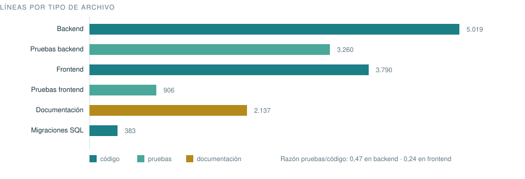

# Métricas

> **Resumen:** El estado del proyecto medido sobre el repositorio, y qué conviene medir del producto cuando esté en producción. Sin estimaciones: todo lo de la primera parte está contado.

## Cómo se han obtenido estos números

Contando sobre el repositorio con `wc`, `git` y la salida real de las pruebas.
**Ninguna cifra de esta sección es una estimación.** La fecha de corte es la del
último commit; para recalcularlas, los comandos están al final.

---

## 1. Estado del código



| Métrica                                      | Valor                    |
| -------------------------------------------- | ------------------------ |
| Líneas de backend (TypeScript)               | 5.019                    |
| Líneas de pruebas de backend                 | 3.260                    |
| Líneas de frontend (TS + plantillas)         | 3.790                    |
| Líneas de pruebas de frontend                | 906                      |
| Líneas de documentación (`docs/` + `legal/`) | 2.137                    |
| Migraciones SQL                              | 383 líneas en 6 archivos |

**Razón pruebas/código: 0,47 en backend.** Es alta y es deliberada: los
invariantes del producto son de concurrencia, y probarlos exige montar ráfagas y
escenarios completos, no comprobar valores de retorno.

## 2. Pruebas

|                    | Backend              | Frontend                |
| ------------------ | -------------------- | ----------------------- |
| Archivos de prueba | 15                   | 4                       |
| Casos              | **166**              | **38**                  |
| Contra qué corren  | PostgreSQL real      | Chrome real (Karma)     |
| Dobles de prueba   | Ninguno para la base | `Api` falso en el panel |

**204 casos en total**, todos en `pnpm check`, que es lo que corre el CI.

### Pruebas de concurrencia por ráfaga

Cinco archivos lanzan ráfagas de 16 peticiones simultáneas contra PostgreSQL
real, con el pool caliente:

| Invariante                  | Fallos con la protección quitada |
| --------------------------- | -------------------------------- |
| Consumo del pase            | 13 de 16                         |
| Reserva de cuota            | 12 de 16                         |
| Toma de trabajos de la cola | 7 de 16                          |
| Pases simultáneos por plan  | 10 de 16                         |
| Perfiles por plan           | 9 de 16                          |
| Doble cobro de un pago      | 10 de 16                         |

**Esa última columna es la métrica que de verdad importa**: mide que la prueba
sirve para algo. Una prueba de concurrencia que no se pone roja al romper el
código a propósito es un verde falso, y en este proyecto ya hubo uno.

## 3. Superficie del sistema

| Métrica                          | Valor                                    |
| -------------------------------- | ---------------------------------------- |
| Rutas HTTP                       | 26                                       |
| Tablas                           | 12                                       |
| Adaptadores del puerto `Storage` | 4 (R2, Supabase, disco, memoria)         |
| Dependencias de ejecución        | 7                                        |
| Superficies de frontend          | 4 (panel, viewer, administración, legal) |

## 4. Producto construido

| Métrica                                | Valor                                         |
| -------------------------------------- | --------------------------------------------- |
| Peso de la imagen de la API            | 445 MB                                        |
| Bundle inicial del frontend            | ~75 kB transferidos                           |
| Bundle del **viewer**                  | ~1 kB además del común                        |
| Accesibilidad (Lighthouse, producción) | **100** en panel y documento                  |
| Buenas prácticas                       | **100**                                       |
| SEO                                    | 63 — **correcto**: es el `noindex` deliberado |

El bundle del viewer se vigila a propósito: es la única superficie que abre
alguien que no es cliente, probablemente desde el móvil.

## 5. Historia

| Métrica          | Valor      |
| ---------------- | ---------- |
| Commits          | 34         |
| Primer commit    | 2026-08-29 |
| Último commit    | 2026-09-02 |
| Bloques cerrados | 10 de 10   |

---

## 6. Qué medir cuando esté en producción

Nada de esto está instrumentado todavía. Está aquí para decidir qué merece la
pena instrumentar **antes** de instrumentarlo, porque cada métrica que se recoge
sobre personas hay que justificarla en el registro del art. 30.

### Salud del sistema

| Indicador                      | Objetivo     | Cómo                                                                                    |
| ------------------------------ | ------------ | --------------------------------------------------------------------------------------- |
| Disponibilidad de `/health`    | > 99 %       | Comprobación externa cada minuto                                                        |
| Latencia de `/api/open/:token` | p95 < 800 ms | **Sin fuente hoy**: Caddy no registra accesos y activarlo guardaría el testigo del pase |
| **Latencia de `/m/:mediaId`**  | p95 < 1,5 s  | Es el cuello: marca cada imagen en cada visita                                          |
| Trabajos en cola fallidos      | 0 sostenido  | `SELECT count(*) … status='failed'`                                                     |
| Última copia correcta          | < 24 h       | Salida de `backup.sh`                                                                   |

### Producto

| Indicador                            | Por qué importa                                                                   |
| ------------------------------------ | --------------------------------------------------------------------------------- |
| **Pases generados / pases abiertos** | Si muchos caducan sin abrirse, los 15 minutos son demasiado poco o el envío falla |
| Tiempo entre generar y abrir         | Dice si la caducidad está bien puesta                                             |
| Perfiles activos por cuenta          | Si casi nadie pasa de uno, los planes están mal segmentados                       |
| Cuota usada sobre la del plan        | Predice quién va a chocar con el límite                                           |
| Medios purgados por retención        | Mide si la caducidad duele o pasa desapercibida                                   |
| Perfiles congelados sin rescatar     | **Cada uno es trabajo a punto de destruirse**                                     |

### Negocio

| Indicador                            | Por qué importa                                                  |
| ------------------------------------ | ---------------------------------------------------------------- |
| Códigos de pago emitidos / cobrados  | Los no cobrados son fricción del cobro manual                    |
| Días entre emitir y cobrar           | Cuando suba, toca la pasarela                                    |
| Cuentas por plan                     | —                                                                |
| Bajas a Prueba por vencimiento       | Distinguir «no le vale» de «se le olvidó pagar»                  |
| **Minutos de administración al día** | Es el indicador que dice cuándo el manual deja de salir a cuenta |

### Lo que NO se va a medir

- **Quién abre un pase**, desde dónde o con qué dispositivo. Rompería una
  propiedad declarada en el registro del art. 30, en el contrato de encargado y
  en el análisis de riesgos. Instrumentarlo obliga a rehacer los tres.
- **Cuánto se mira cada foto.** Mismo motivo.

> Los agregados de las tablas anteriores se pueden calcular **sin identificar a
> nadie**: cuentan pases, no personas.

---

## Cómo recalcular la sección 1

```bash
find src -name '*.ts' | xargs wc -l | tail -1              # backend
find test -name '*.ts' | xargs wc -l | tail -1             # pruebas backend
grep -h '  it(' test/*.spec.ts | wc -l                     # casos backend
cat web/src/app/*/*.spec.ts | grep -c '  it('              # casos frontend
git rev-list --count HEAD                                  # commits
docker images vistta-api:latest --format '{{.Size}}'       # imagen
```
